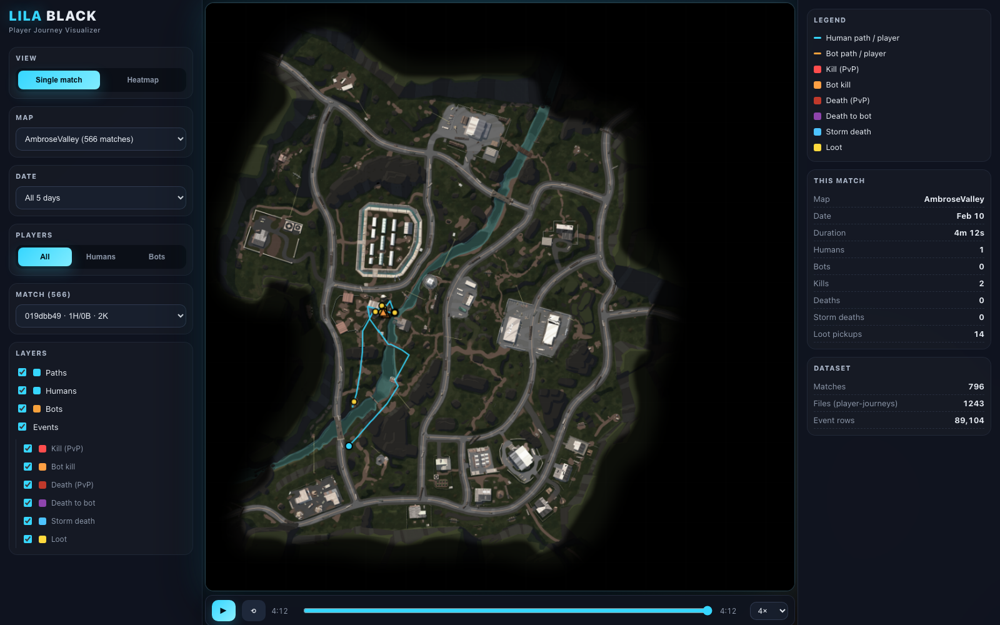
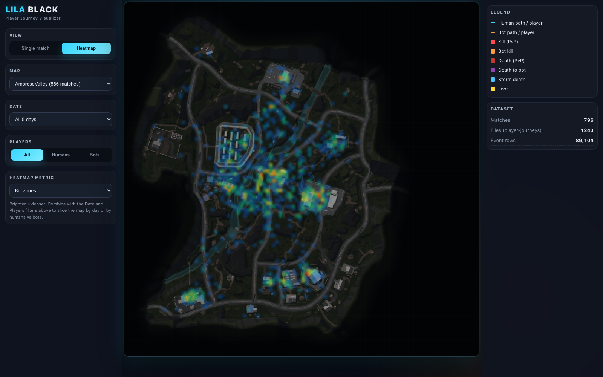

# Playtrace — LILA BLACK Player Journey Visualizer

Playtrace is a React + Vite web app for exploring LILA BLACK gameplay telemetry on the provided minimaps. It turns the raw `.nakama-0` Parquet player journey files into a browser tool a level designer can use to inspect routes, combat, loot, storm deaths, and map-level hotspots.

## Live App

- **Deployed URL:** https://playtrace-gules.vercel.app/
- **Hosting:** Vercel
- **Runtime:** fully static React app; no backend server or environment variables required

## Screenshots

### Single-Match Playback



### Kill-Zone Heatmap



## What Reviewers Should Check

- Player journeys render on the correct minimap.
- World `(x, z)` telemetry coordinates are mapped to minimap pixels using the dataset README's scale/origin formula.
- Humans and bots are visually distinguishable.
- Kill, death, bot kill, bot death, storm death, and loot events use distinct markers.
- Filters work for map, date, match, and player type.
- Timeline playback supports play/pause, scrub, speed, restart, and replay from the end.
- Heatmaps support traffic, human traffic, kill zones, death zones, storm deaths, and loot.
- `ARCHITECTURE.md` explains the pipeline, coordinate mapping, assumptions, and tradeoffs.
- `INSIGHTS.md` contains three concrete, evidence-backed level-design observations.

## Tech Stack

| Layer | Choice |
|---|---|
| Frontend | React + Vite |
| Rendering | HTML Canvas |
| Data preprocessing | Python |
| Parquet parsing | Custom zero-dependency reader in `tools/parquet_reader.py` |
| Runtime data | Static JSON in `web/public/data` |
| Hosting | Vercel |

## How The Project Works

```text
player_data/February_*/*.nakama-0
  -> tools/parquet_reader.py
  -> tools/build_dataset.py
  -> web/public/data/index.json
  -> web/public/data/matches/<match_id>.json
  -> web/public/data/agg/<map>.json
  -> React app fetches static JSON
  -> Canvas renders minimap, paths, markers, playback, and heatmaps
```

The repo includes both the raw assignment data and the generated static JSON. The deployed Vercel app only needs the generated files under `web/public`, so production does not run Python or parse Parquet.

## Data Included

| Item | Count |
|---|---:|
| Raw Parquet player-journey files | `1,243` |
| Event rows | `89,104` |
| Reconstructed matches | `796` |
| Maps | `AmbroseValley`, `GrandRift`, `Lockdown` |
| Date range | February 10–14, 2026 |

## Project Structure

```text
playtrace/
├── README.md
├── ARCHITECTURE.md
├── INSIGHTS.md
├── package.json                  # one-command setup/test/build scripts
├── docs/
│   └── screenshots/              # README screenshots captured from the deployed app
├── player_data/                  # raw assignment data kept in the repo
│   ├── February_10/
│   ├── February_11/
│   ├── February_12/
│   ├── February_13/
│   ├── February_14/
│   ├── minimaps/
│   └── README.md
├── tools/
│   ├── parquet_reader.py         # dependency-free reader for this dataset's Parquet subset
│   ├── build_dataset.py          # raw player_data -> web/public/data
│   └── verify_project.py         # repo readiness + data/docs checks
└── web/
    ├── public/
    │   ├── data/                 # generated JSON consumed by the app
    │   └── minimaps/             # copied minimap assets
    ├── src/
    │   ├── components/
    │   └── lib/
    ├── package.json
    └── vite.config.js
```

## Local Setup

```bash
git clone https://github.com/adityaRaj369/playtrace.git
cd playtrace
npm run setup
npm --prefix web run dev
```

Open the local URL printed by Vite, usually `http://127.0.0.1:5173/`.

## Verify Everything

Run this from the repository root:

```bash
npm run verify
```

This single command prints pass/fail status for:

- repo readiness checks in `tools/verify_project.py`
- frontend unit tests
- production build

The tests cover coordinate conversion, heatmap filtering, audience filtering, match filtering, and playback replay behavior.

## Regenerate The Static Dataset

Run this only if the raw `player_data/` changes:

```bash
python3 tools/build_dataset.py
```

The script reads the raw `.nakama-0` files, writes generated JSON into `web/public/data`, and copies minimaps into `web/public/minimaps`. No Python packages are required.

## Vercel Deployment

The project is deployed from the `web/` app directory.

| Setting | Value |
|---|---|
| Framework preset | Vite |
| Root directory | `web` |
| Install command | `npm install` |
| Build command | `npm run build` |
| Output directory | `dist` |
| Environment variables | none |

## Usage Walkthrough

1. Open the deployed app.
2. Use **Single match** to inspect one reconstructed match.
3. Choose a map, date, and match from the left panel.
4. Use **All / Humans / Bots** to isolate player types.
5. Toggle path and event layers to inspect movement and discrete events.
6. Scrub or play the timeline to watch a match unfold.
7. Switch to **Heatmap** to inspect traffic, kill zones, death zones, storm deaths, or loot.
8. Read `INSIGHTS.md` for three actionable observations found with the tool.

## Implementation Notes

- Humans are detected by UUID-like `user_id`; bots are detected by numeric `user_id`.
- Event byte values are decoded during preprocessing.
- The app uses `x` and `z` for 2D plotting. The dataset's `y` field is elevation and is not used for minimap placement.
- Coordinate mapping is tested against the worked example from `player_data/README.md`.
- Raw data is included so reviewers can inspect or regenerate the processed JSON.
